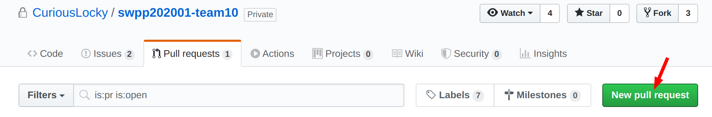
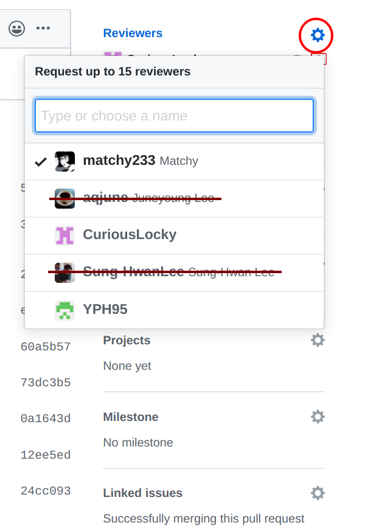

# How to Contribute to our project

The basic workflow should be as follows:

1. [Make a new branch](#make-a-new-branch)
2. [Code under the branch](#code-under-the-branch)
3. [Pull from master(optional)](#pull-from-master-when-necessary)
4. [Test your code](#test-your-code)
5. [Raise a Pull Request](#raise-a-pull-request)
6. Code Review
7. Resolve Conflicts & Merge to master

Some more instructions are provided below. You can also click on the title to jump to it.

## Make a new branch

**Clone the repository directly but not make a fork,** i.e., you should do 

```zsh
git clone git@github.com:CuriousLocky/swpp202001-team10.git
# or git clone https://github.com/CuriousLocky/swpp202001-team10.git
```
instead of cloning your own fork. There are advantages and disadvantages of using branch+protected master v.s. using forks. Here we choose to use 

Make a new branch every time you want to make a new optimization. Name the new branch after your new optimization. For example, if you want to do optimization Function Outlining, you should

```zsh
git checkout -b function-outlining
```

And then you can develop on that branch freely. Note that the changes should not be more than 200 lines. You can check this by 
```zsh
git diff origin/master
```
to see the differences from your branch and `origin/master`. If you are only interested with the lines changes, you can do 
```
git diff origin/master | grep @@
```
It should show a couple of lines that describe the changes in files and lines of code in the form of this:

```zsh
# format:
### @@ -[num of files deleted],[num of lines deleted] +[num of files added], [num of lines added] 
# Add 1 file with 8 lines of code
@@ -0,0 +1,8 @@
# Delete 1 file with 22 lines of code
@@ -1,22 +0,0 @@
```
## Code under the branch

**Use the templates provided in `/skeleton-code` directory as the skeleton code if you are implementing a IR-level optimization by a Function Pass.** Read the [README.md](/skeleton-code/README.md) there carefully before you code!!! Please do not overwrite `Example.h` and `Example.cpp` but make copies.

## Pull from master (when necessary)

During your development, there might also be changes pushed to the `master` branch or other people's pull requests merged into the `master` branch. In this case you should pull from `master` branch to make your branch updated.

To check whether you need to pull or not, you should run the following command every so often.
```zsh
git remote -v update
```
This will update your local remote refs. Run in verbose mode with the `-v` flag. In this case it will show you which branches are updated. If you see that master branches are updated , you should merge `origin/master` into your current branch and resolve possible conflicts.

```zsh
# Assuming you are not on master branch
git merge origin/master
```

## Test your code

Write File Checks or run `run-test.sh` according to the instructions in [README.md](/README.md#run-tests-provided-by-ta) to check the integrity of your implementation.

## Raise a pull request

You can do this on GitHub website (or install GitHub CLI, but it's not very intuitive to use for GitHub newbies) by going to the Pull Requests tab and click the green button "new pull request"



Choose `master` as the base branch and compare with the branch you code on, and then Create the pull request.

Remember to request others to review your pull request by selecting reviewers here:

